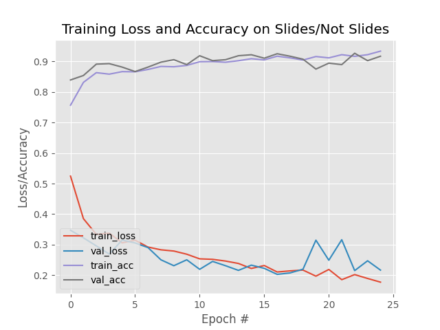

## GROUN - Get Rid of Your Notes

GROUN is an application which can be used to delete the spam related to lecture slides/notes present in our mobile devices. It currently predicts the image to be a lecture slide or not with a validation accuracy of 91 percent.

### Architecture

The model is built on the standard LeNet architecture and on a dataset of over 2000 images, further increased through Data Augmentation.

### Project Execution

1. Open the `Terminal`.
2. Clone the repository by entering `https://github.com/pranay-ar/GROUN.git`.
3. Ensure that `Python3` and `pip`/`conda` is installed on the system.
4. Create a `virtualenv` by executing the following command: `virtualenv -p python3 env`.
5. Activate the `env` virtual environment by executing the follwing command: `source env/bin/activate`.
6. Enter the cloned repository directory and execute `pip install -r requirements.txt`.
7. Now, execute the following command: `python test.py --model slides.model \` and it will ask for the image location you want to test the model on.
8. Enter the image location as follows: `image <location>` and the model will display the results.

### Performance Overview

### Miscellaneous

Inorder to create a custom dataset, the following [link](https://www.pyimagesearch.com/2017/12/04/how-to-create-a-deep-learning-dataset-using-google-images/) can be used to create a script to download mutliple images at once for a single query.

I am currently working on creating a web-application to automate this process of deleting the spam images present in our devices. Feel free to open an issue to improve an existing feature or to collaborate on this together.
